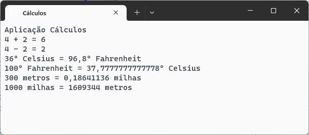

# TarefaTrêsCálculos  :1234:
 
 Cálculos

Aplicação C# para efetuar diversos tipos de cálculos

Desenvolvida no âmbito da acção de formação **Introdução ao Git e Github**

## Operações suportadas

Neste momento esta aplicação implementa as seguintes operações:
- Soma
- Subtração
- conversão de temperaturas
    - Clesius :arrow_right: Fahrenheit
    - Fahreheit :arrow_right: Clesius

- conversão de distâncias:

     - metros :arrow_right: minhas
     - minhas :arrow_right: metros

## Tecnologias utilizadas neste projeto
**Visual Studio**
- C#
- Git
- Github
- Plataforma Github
## Site oficial